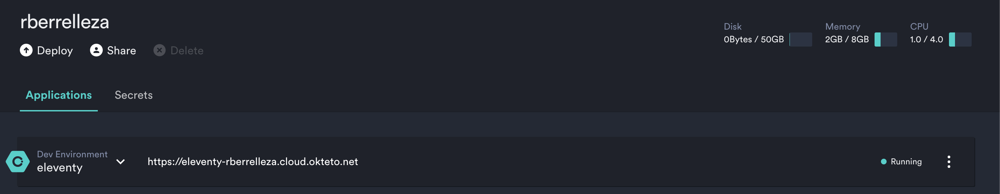

# Make a static website with Eleventy and Okteto Cloud
[Eleventy](https://github.com/11ty/eleventy/) is a super simple and intuitive static site generator.

In this tutorial we'll talk about how you can Eleventy and [Okteto Cloud](https://cloud.okteto.com) together to quickly create, update and deploy static websites and applications.

## Pre-requisites
1. Install the [Okteto CLI](https://github.com/okteto/okteto).
1. Run `okteto login` to create your account in [Okteto Cloud](https://cloud.okteto.com) and link it to your local machine.

## Getting started

For this tutorial, we'll make a website that shows the world  our favorite Party Parrot gifs, courtesy of https://cultofthepartyparrot.com/

> The finished source code of the tutorial is included [on this repo](https://github.com/rberrelleza/eleventy)

First, make a directory for your website:
```console
mkdir my-parrots
```

And a subfolder for our gifs:
```
mkdir my-parrots/img
```

Go to https://cultofthepartyparrot.com/, and download five of your favorite gifs, and save them inside the `my-parrots/gifs` folder. These are mine:

```console
cd my-parrots/gifs
wget -O my-parrots/img/parrot.gif https://cultofthepartyparrot.com/parrots/hd/parrot.gif
wget -O my-parrots/img/partyparrot.gif https://cultofthepartyparrot.com/parrots/hd/partyparrot.gif
wget -O my-parrots/img/jediparrot.gif https://cultofthepartyparrot.com/parrots/hd/jediparrot.gif
wget -O my-parrots/img/dealwithitparrot.gif https://cultofthepartyparrot.com/parrots/hd/dealwithitparrot.gif
wget -O my-parrots/img/boredparrot.gif https://cultofthepartyparrot.com/parrots/hd/boredparrot.gif
```

Now let's create our template.  Create a file called `index.html` inside the `my-parrots` directory, and add a list of your gifs.

```html
<html>
  <head>
    <title>Party Parrots</title>
  </head>
  <body>
    <h1>Party Parrots</h1>
    <ul>
      <li><a href="img/boredparrot.gif">boredparrot.gif</a></li>
      <li><a href="img/dealwithitparrot.gif">dealwithitparrot.gif</a></li>
      <li><a href="img/jediparrot.gif">jediparrot.gif</a></li>
      <li><a href="img/parrot.gif">parrot.gif</a></li>
      <li><a href="img/partyparrot.gif">partyparrot.gif</a></li>
    </ul>
  </body>
</html>
```

## Start your development environment

Now that we created the initial assets, we'll run  `eleventy` to generate the site. But I don't have `node` or even `eleventy` installed locally. So instead of installing all those dependencies locally and messing up with my local setup, I'm going to launch a preconfigured development environment in Okteto Cloud.

Create an `okteto.yml` manifest file to describe your development environment:
```
name: eleventy
image: okteto/eleventy  # this docker image contains all your dev tools
command:
- bash
forward:
  - 8080:8080
  - 3001:3001

```

Create an `.eleventy.js` configuration file, to tell eleventy with file extensions we want to use and to listen in all interfaces in the development environment.

```javascript
module.exports = function(eleventyConfig) {
  eleventyConfig.setTemplateFormats("html,liquid,njk,gif,jpg");
  eleventyConfig.setBrowserSyncConfig({
    host: "0.0.0.0"
  });
}
```

Activate your Okteto Cloud namespace:

```console
okteto namespace
```
```
okteto namespace
 ✓  Updated context 'cloud_okteto_com' in '/Users/ramiro/.kube/config'
```

And start your development environment:
```
okteto up 
```

```console
 ✓  Development environment activated
 ✓  Files synchronized
    Namespace: rberrelleza
    Name:      eleventy
    Forward:   8080 -> 8080
               3001 -> 3001
Welcome to your development environment. Happy coding!
okteto>
```

To generate your site, run the `eleventy --serve` command directly in the remote development environment (the one with the `okteto>` console prompt), just like we would locally:

```console
okteto> eleventy --serve
```

```console
Writing _site/index.html from ./index.html.
Writing _site/README/index.html from ./README.md.
Writing _site/my-parrots/index.html from ./my-parrots/index.html.
Wrote 3 files in 0.30 seconds (v0.10.0)
Watching…
[Browsersync] Access URLs:
 ----------------------------------
       Local: http://localhost:8080
    External: http://0.0.0.0:8080
 ----------------------------------
          UI: http://localhost:3001
 UI External: http://localhost:3001
 ----------------------------------
[Browsersync] Serving files from: _site
```

`okteto up` will synchronize all your files between your local and remote environments. It will also automatically forward ports 8080 and 3001 from your local machine to your development environment. This means that we can directly see your website by going to `http://localhost:8080/my-parrots`.

## Make it a template

Now, let's play with  eleventy's features. Instead of having an plain html file, we'll convert it into a `liquid` template. Update your `index.html` file so it looks like this:

```html
---
title: Party Parrots
images:
  - boredparrot.gif
  - dealwithitparrot.gif
  - jediparrot.gif
  - parrot.gif
  - partyparrot.gif
---
<html>
  <head>
    <title>{{ title }}</title>
  </head>
  <body>
    <h1>{{ title }}</h1>
    <ul>
      
      <li><a href="img/{{ filename }}">{{ filename }}</a></li>
      
    </ul>

    Powered with joy by Eleventy and Okteto.
  </body>
</html>
```

We are using `eleventy`'s templating engine to define the `title` and the list of `images` in markdown so make it more data driven. We are also adding a small message at the end.

At this point, if you look at your remote development environment terminal (the one with the `>okteto` command prompt), you'll see a lot of things going on there. What happened there? Well, every time you changed a file locally, `okteto up` synchronized it with your development environment. There, the `eleventy --watch` command picked up the change, and automatically regenerated and even reloaded your website.

Now go back to your browser.  The changes are already loaded. Any future change you made in your templates will appear automatically in the browser pretty much as you type it. Pretty cool no 😎? 

Why don't you go ahead and add a 6th party parrrot to our list?

## Ship your changes

Our website is looking great, so it's time to ship it to the world. Normally, this would require you to signup to some hosting service, ge the credentials, generate your static files, and deploy your new website. 

Instead of all of that, we'll use the `okteto push` command to instantly push our changes to Okteto Cloud.

First, press `ctrl +c` to stop the `eleventy` process, and type `exit` to exit your development environment:
```console
okteto> exit
```

Then, run the `okteto push` command to push your changes to the cloud:
```console
> okteto push
```

```console
 i  Running your build in Okteto Cloud...

------
 > importing cache manifest from registry.cloud.okteto.net/rberrelleza/eleventy:okteto:
------
 ✓  Source code pushed to the development environment 'eleventy'
```

At this point, your website is up and running. Browse to [Okteto Cloud](https://cloud.okteto.com) and click on the link in the `eleventy` application to see it live.



# Conclusion

In this tutorial we talked about how you can leverage Okteto to make it super simple to build and deploy your Elevate static websites. With Okteto you get:
- Pre-configured development environments, so you don't need to install anything locally.
- Automatic file synchronization and port-forwarding, so you can keep using your favorite local tools.
- Almost-instant deploys to the cloud, to show the world your creations. 

Hope you like this! Feel free to [reach out to me](https://twitter.com/rberrelleza) if you have any questions, feedback or ideas on how to make development easier and more accesible to all!

> This tutorial is based on Zach Leat's amazing [Eleventy Tutorial Level 1](https://www.zachleat.com/web/eleventy-tutorial-level-1/). Check out his blog to learn more about Eleventy!

